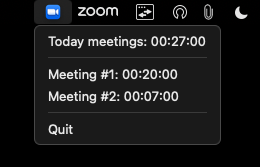

<div align="center">
  
</div>

<div align="center">

# Zoom Meeting Tracker

A simple application to track Zoom meeting time throughout the day.

</div>


## Features

- Tracks the time spent in Zoom meetings.
- Provides a daily summary of meeting durations.


## Screenshots



## Downloads
- Mac os (Arm 12.5+) [Zip](https://mega.nz/folder/4KFWmBaa#rkwpRoDtkdrbDziqWh89-g)

## Installation

Make sure you have [Node.js](https://nodejs.org/) installed.

```bash
# Clone the repository
git clone https://github.com/denistol/zoomtrack

# Navigate to the project directory
cd zoomtrack

# Install dependencies
npm install

# Build the app
npm run build
